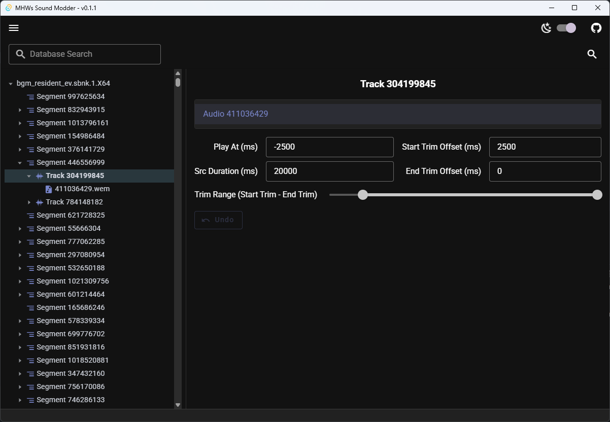

# User Manual

- [User Manual](#user-manual)
  - [Game Audio File Structure](#game-audio-file-structure)
  - [How to Replace Audio](#how-to-replace-audio)
  - [Simple Usage Workflow](#simple-usage-workflow)
    - [1. Extract the `bnk` and `pck` files you need to edit](#1-extract-the-bnk-and-pck-files-you-need-to-edit)
    - [2. Open files with MHWs Sound Modder](#2-open-files-with-mhws-sound-modder)
    - [3. Edit file information](#3-edit-file-information)
    - [4. Export files](#4-export-files)
  - [Complete Feature Introduction](#complete-feature-introduction)
    - [Node Tree](#node-tree)
    - [Info Panel](#info-panel)
      - [Segment](#segment)
      - [Track](#track)
      - [Audio](#audio)
  - [Common Issues](#common-issues)
    - [Audio playback errors](#audio-playback-errors)
    - [Unable to transcode/import/export audio](#unable-to-transcodeimportexport-audio)


## Game Audio File Structure

There are only two audio file formats in the game: `bnk` and `pck`. In the game, they are called `sbnk` and `spck`, but they are the same thing, so the former will be used in the following text.

PCK can only contain a single audio file, usually as a carrier for streaming audio.

BNK can not only contain audio but also important audio event orchestration and audio clip metadata. BNK is a flexible format that can contain or not contain audio, and can contain or not contain metadata. Therefore, it's difficult to identify the composition of a BNK file just by appearance.

Below introduces a pattern that can analyze file composition. File size can also help determine what data a file might contain.

In the following content, we will represent the game directory `Sound/Wwise` as the **default path** and `streaming/Sound/Wwise` as the **streaming path**.

```
File tree example:

Case 1:
Sound/Wwise
- Wp00_Cmn.sbnk.1.X64         // Contains only partial metadata
- Wp00_Cmn_Effect.sbnk.1.X64  // Contains only partial metadata
- Wp00_Cmn_m.sbnk.1.X64       // Files with _m suffix, and no files with the same name
                              // in streaming, represent that this file is the actual 
                              // audio storage library

Case 2:
Sound/Wwise
- Cat_cmn_ev.sbnk.1.X64   // Files with _ev generally can be considered to contain only metadata
- Cat_cmn_m.sbnk.1.X64    // This is an empty file, only used for placeholder
- Cat_cmn_m.spck.1.X64    // This is an empty file, only used for placeholder
streaming/Sound/Wwise
- Cat_cmn_m.spck.1.X64    // This file contains actual audio
```

## How to Replace Audio

First, let me clarify that the author is not very clear about the details of the game's audio system, especially since Wilds has split the audio library very scattered. The following content is summarized through practice and others' practice results, and may be incorrect.

For audio replacement, after multiple experiments, it can be considered that **PCK files in streaming cannot be modified, any modification will cause PCK audio to fail**, even if the headers of the empty files used for placeholders are also modified synchronously. At least this is the case for Loose File Loader.

Therefore, it is currently only recommended to replace audio into BNK files in non-streaming directories. This can also be done for BNK files without actual audio data. After replacement, the corresponding audio in the original PCK will become invalid.

For Case 1, directly replace the existing audio in `Wp00_Cmn_m.sbnk.1.X64`.

For Case 2, you can write the audio you want to replace into `Cat_cmn_m.sbnk.1.X64`. Originally, this file only contains (or doesn't contain) audio index headers, without any data, but new data can be written into it.

## Simple Usage Workflow

### 1. Extract the `bnk` and `pck` files you need to edit

You can extract files through [eigeen/ree-pak-gui](https://github.com/eigeen/ree-pak-gui).

Files are located in `natives/STM/Sound/Wwise` and `natives/STM/streaming/Sound/Wwise`.

### 2. Open files with MHWs Sound Modder

1. Click the menu in the upper left corner and select "Open File".
2. Select the files you want to import. You can select multiple files at once.

Note: It's not recommended to import a huge number of files at once, as the current UI design is not designed to display large amounts of data simultaneously, which may cause lag.

### 3. Edit file information

- In the left file tree, click the arrow on the far left to expand and collapse nodes. Click on the node name to display editable content in the right info panel.
- Right-click the corresponding node to pop up a menu for operations.
- Quick audio import: Drag audio files from the file browser to the program window and place them on the Audio node you want to replace. The node background will turn red. Release to quickly replace.
- Right-click the file node (root node) to add new audio, which is useful when adding audio to files that don't contain audio indexes.

### 4. Export files

1. After editing, click the menu in the upper left corner again and select "Export File".
2. Select the export directory. The exported files and export logs will be stored in the directory you choose.

## Complete Feature Introduction

### Node Tree

The node tree is located on the left and can be expanded or collapsed by clicking the small arrow to the left of each node.

Right-clicking a node will show a context menu, and the content of the context menu varies for different types of nodes.

Click on the node name to select that node and set it as the current editing target.

### Info Panel

For more information about Wwise, including detailed explanations of various parameters below, please refer to: [bnnm/wwiser/doc/WWISER.md](https://github.com/bnnm/wwiser/blob/master/doc/WWISER.md#understanding-wwiser-output)

#### Segment


Parameters:

- Duration (ms): Total length of the Segment
- Fade-in / Fade-out Duration: Not extensively tested. If you encounter issues, set them all to 0

#### Track



Note that a Track may contain multiple data. Select the data you want to edit from the list above.

Parameters:

- Play At (ms): If no special requirements, default to the opposite number of Start Trim Offset. Usually negative
- Start Trim Offset (ms): Length of beginning trim
- End Trim Offset (ms): Length of ending trim
- Src Duration (ms): Length of the input source file. This field normally needs to be adjusted to the actual length of the audio. In the future, this field will be automatically updated when importing audio. Currently, it needs to be handled manually.

#### Audio


Can be used to preview and play audio files.

Click Playback to export and transcode the audio. After processing is complete, an audio playback progress bar will be displayed and playback will begin.

If you have already replaced the audio with your own, the Play Original button will also be displayed. At this time, the original Playback will become playing the replaced audio.

For transcoded audio, a set of data will be displayed below. This set of data is used for reference to judge loudness information.

Peak (dBFS) represents the peak decibel of the audio, with 0 being the maximum. This is more meaningful for short sound effects.

[Loudness units relative to full scale (LUFS)](https://en.wikipedia.org/wiki/LUFS) is a loudness unit that better measures the overall auditory loudness of a piece of audio. It's meaningful for music and longer audio.

Here's an example:

> A music replacement
> 
> Original Loudness | Peak (dBFS): -12.5 | LUFS: -29.0
> 
> Replaced Loudness | Peak (dBFS): 0.0 | LUFS: -10.6

This data indicates that the replaced audio is much louder than the game's original audio, which will cause the audio to be too loud in the game after replacement. Therefore, the loudness gain value of the replaced audio needs to be reduced. (Through audio editing tools such as Audition, FFmpeg, etc.)

## Common Issues

### Audio playback errors

You may see messages like:

```
Failed to play audio: Error: Failed to fetch playback audio: No data found in Bnk file. This Bnk may not contain actual sound data.
```

This indicates that the archive file you opened does not contain the actual data of the audio. That is, these files may only contain references or indexes to audio files, not actual data.

Solution: Open files that contain actual data at the same time. You can refer to [Game Audio File Structure](#game-audio-file-structure) to speculate which files might contain the actual data.


### Unable to transcode/import/export audio

You may be missing some external components. Refer to [README.md](../README.md#external-components) to complete the missing components.

