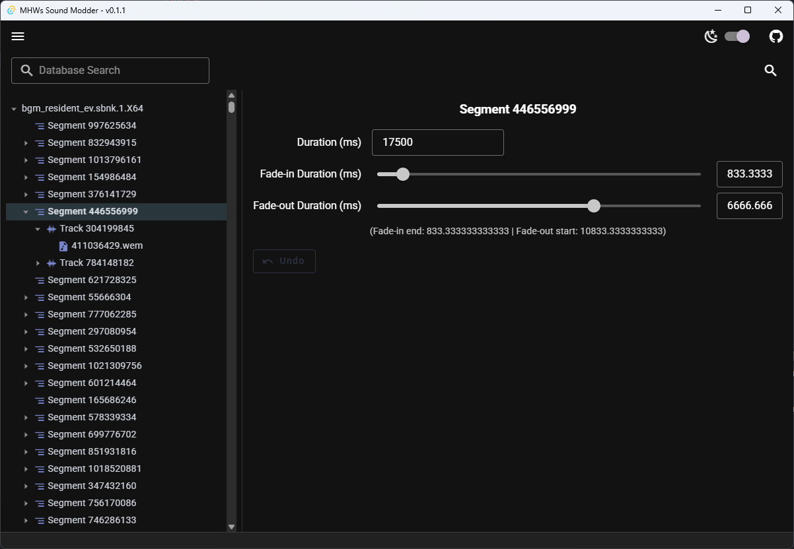
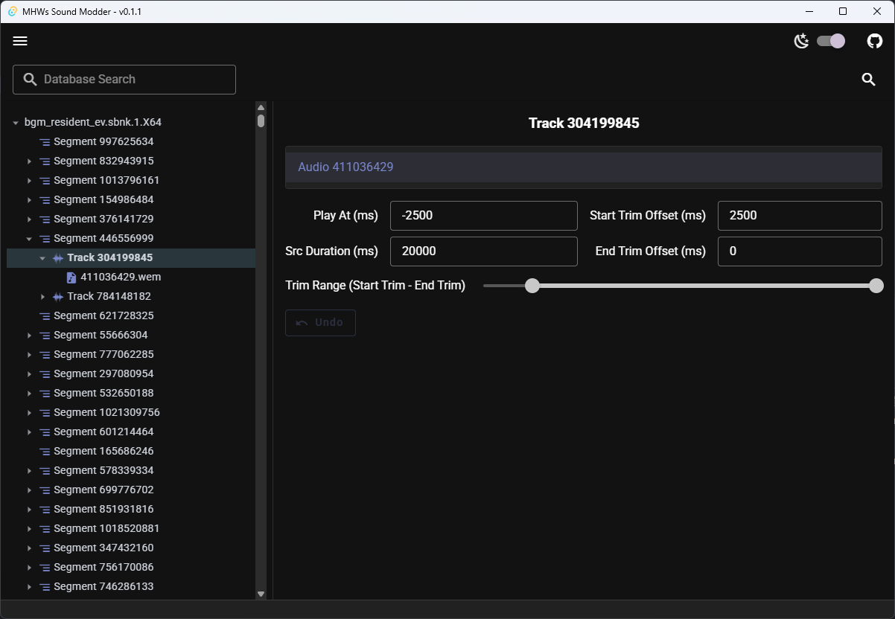
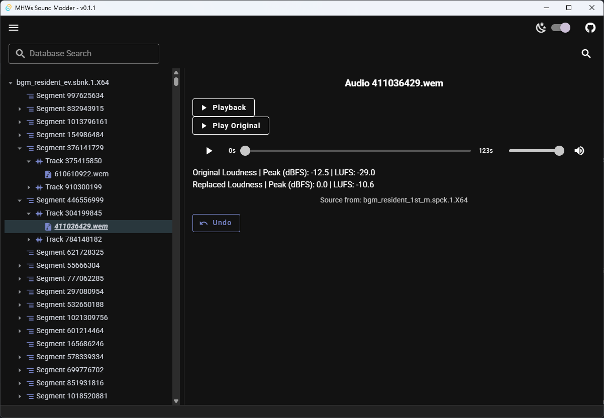
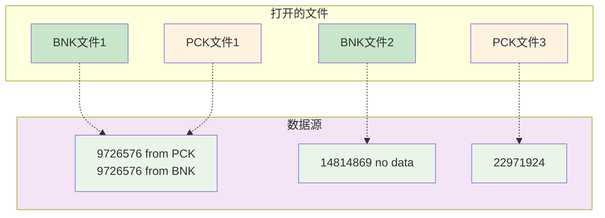

# 用户手册

- [用户手册](#用户手册)
  - [游戏音频文件结构](#游戏音频文件结构)
  - [如何替换音频](#如何替换音频)
  - [简单使用流程](#简单使用流程)
    - [1. 提取你需要编辑的 `bnk` 和 `pck` 文件](#1-提取你需要编辑的-bnk-和-pck-文件)
    - [2. 使用 MHWs Sound Modder 打开文件](#2-使用-mhws-sound-modder-打开文件)
    - [3. 编辑文件信息](#3-编辑文件信息)
    - [4. 导出文件](#4-导出文件)
  - [完整特性介绍](#完整特性介绍)
    - [节点树](#节点树)
    - [信息面板](#信息面板)
      - [Segment](#segment)
      - [Track](#track)
      - [Audio](#audio)
  - [常见问题](#常见问题)
    - [播放音频时出错](#播放音频时出错)
    - [无法转码/导入导出音频](#无法转码导入导出音频)


## 游戏音频文件结构

游戏内只有两种音频文件格式，`bnk` 和 `pck`。游戏内叫做`sbnk` 和 `spck`，但是他们是一样的东西，所以后文都用前者替代。

其中PCK只能包含单个的音频文件，通常是作为streaming音频的载体。

而BNK不仅可以包含音频，也包含了重要的音频事件编排和音频剪辑等元数据。BNK是个自由的格式，它可以包含或不包含音频，也可以包含或不包含元数据。因此仅通过外观难以辨认某个BNK文件的组成。

下面介绍一个规律，可以分析文件组成。同时用文件大小也可以辅助判断该文件可能包含哪些数据。

以下介绍的内容中，我们将游戏目录 `Sound/Wwise` 表示为**默认路径**，`streaming/Sound/Wwise` 表示为**streaming路径**。

```
文件树示例：

案例 1:
Sound/Wwise
- Wp00_Cmn.sbnk.1.X64         // 仅包含部分元数据
- Wp00_Cmn_Effect.sbnk.1.X64  // 仅包含部分元数据
- Wp00_Cmn_m.sbnk.1.X64       // 带有_m后缀的文件，且streaming中没有相同名字的文件，代表该文件是实际音频存储库

案例 2:
Sound/Wwise
- Cat_cmn_ev.sbnk.1.X64   // 带_ev的一般可认为只包含元数据
- Cat_cmn_m.sbnk.1.X64    // 这是个空文件，仅用于占位
- Cat_cmn_m.spck.1.X64    // 这是个空文件，仅用于占位
streaming/Sound/Wwise
- Cat_cmn_m.spck.1.X64    // 此文件包含实际音频
```

## 如何替换音频

首先说明，笔者也不太清楚游戏音频系统工作细节，尤其是Wilds将音频库拆分得非常散。以下内容通过实践和他人实践结果总结，可能有误。

对于音频替换，目前经过多次实验可认为，**无法对streaming内的PCK进行修改，任何修改都会导致PCK音频失效**，即便将用于占位的空文件头部也同步修改也不行。至少对于Loose File Loader是如此。

因此目前仅推荐将音频替换到非streaming目录下的BNK内。对于无实际音频数据的BNK文件也可以如此操作。替换后，原有的PCK内对应的音频将会失效。

对于案例1，直接替换 `Wp00_Cmn_m.sbnk.1.X64` 内已有的音频即可。

对于案例2，你可以将需要替换的音频写入到 `Cat_cmn_m.sbnk.1.X64` 内。原本在该文件内只存在（或不存在）音频的索引头，不包含任何数据，但是可以将新的数据写入。

## 简单使用流程

### 1. 提取你需要编辑的 `bnk` 和 `pck` 文件

可通过 [eigeen/ree-pak-gui](https://github.com/eigeen/ree-pak-gui) 提取文件。

文件位于 `natives/STM/Sound/Wwise` 以及 `natives/STM/streaming/Sound/Wwise` 内。

### 2. 使用 MHWs Sound Modder 打开文件

1. 点击左上角菜单，选择打开文件。
2. 选择你需要导入的文件，可以一次选择多个。

注：不推荐一次性导入巨量的文件，当前UI设计不是为同时显示大量数据设计的，可能会出现卡顿。

### 3. 编辑文件信息

- 在左侧文件树，点击最左侧的箭头展开和收起节点。点击节点名，会在右侧信息面板显示节点可编辑内容。
- 右键对应节点可以弹出菜单进行操作。
- 快捷导入音频：将音频文件从文件浏览器拖动到程序窗口，置于你想替换的 Audio 节点上，此时节点背景色变红。松手即可快速替换。
- 右键文件节点（根节点）可以新增音频，这对于向不包含音频索引的文件新增音频时很有用。

### 4. 导出文件

1. 编辑完成后，再次点击左上角菜单，选择导出文件。
2. 选择导出目录，导出的文件和导出时的日志会存放到您选择的目录中。

## 完整特性介绍

### 节点树

节点树位于左侧，可以通过点击每个节点左侧的小箭头展开或收起。

右键节点会显示右键菜单，不同类型节点的右键菜单内容不一样。

点击节点名选中该节点，以便设为当前编辑目标。

### 信息面板

如需了解更多关于 Wwise 的一些信息，包括下面各种参数的详细释义，请参阅：[bnnm/wwiser/doc/WWISER.md](https://github.com/bnnm/wwiser/blob/master/doc/WWISER.md#understanding-wwiser-output)

#### Segment



参数：

- Duration (ms): Segment 总长度
- Fade-in / Fade-out Duration: 未经过太多测试，如果遇到问题，将他们全部设为0

#### Track



注意，一个 Track 可能包含多个数据，在上方的列表中选择你所要编辑的数据。

参数：

- Play At (ms): 如无特殊要求，默认为 Start Trim Offset 的相反数。通常为负数
- Start Trim Offset (ms): 开头剪辑长度
- End Trim Offset (ms): 末尾剪辑长度
- Src Duration (ms): 输入源文件的长度。此项正常需要调整为音频的实际长度。在未来会实现导入音频时自动更新该字段。目前需要手动处理。

#### Audio



可以用于播放预览音频文件。

点击 Playback ，会导出并转码音频，处理完成后显示音频播放进度条，并开始播放。

如果你已经使用自己的音频替换，则会同时显示 Play Original 按钮，此时原本的 Playback 会变成播放替换后的音频。

对于转码完成的音频，下方会显示一组数据。这组数据用于参考判断响度信息。

Peak (dBFS) 表示音频峰值分贝，0为最大。对于短音效比较有参考意义。

[Loudness units relative to full scale (LUFS)](https://en.wikipedia.org/wiki/LUFS) 是一种响度单位，它更好地衡量一段音频的总体听觉响度，对于音乐和较长的音频有参考意义。

以下是一个样例

> A music replacement
> 
> Original Loudness | Peak (dBFS): -12.5 | LUFS: -29.0
> 
> Replaced Loudness | Peak (dBFS): 0.0 | LUFS: -10.6

该数据表明，替换的音频比游戏原始的音频大得多，这会导致替换后，游戏内音频过响。因此需要降低替换音频的响度增益值。（通过音频编辑工具，如 Audition, FFmpeg 等）

## 常见问题

### 播放音频时出错

可能会提示类似信息：

```
Failed to play audio: Error: Failed to fetch playback audio: No data found in Bnk file. This Bnk may not contain actual sound data.
```

这表明你所打开的归档文件内不包含音频的实际数据。也就是这些文件内可能只包含了音频文件的引用或索引，不包含实际数据。

解决办法：同时打开包含实际数据的文件。你可以参考 [游戏音频文件结构](#游戏音频文件结构) 来推测实际数据可能在哪些文件内。



### 无法转码/导入导出音频

你可能缺少部分外部组件，参考 [README.md](../README.md#external-components) 补全缺少的组件。
